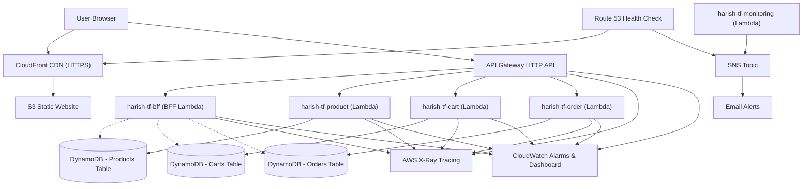

# Serverless E‑Commerce Platform

A lightweight, serverless e‑commerce demo built on AWS and managed entirely with Terraform. It showcases:

- **Three micro‑services** (product, cart, order) behind an API Gateway
- **Backend‑for‑Frontend (BFF)** that aggregates data in parallel
- **Observability** with structured logs, CloudWatch metrics, and X‑Ray tracing
- **CI/CD** using GitHub Actions (format check, unit tests, Terraform validation)
- **Zero‑idle‑cost design** – runs within the AWS free tier when idle

---

## Quick Start

### Prerequisites
- Python 3.12+ (for unit tests and scripts)
- Terraform 1.5+ 
- AWS CLI configured with appropriate credentials (SSO profile `idp-sbx-trn‑lab‑01` by default)

### Local verification
```bash
# Install Python dependencies
pip install -r requirements.txt

# Run unit tests
pytest -v

# Deploy infrastructure (preview only)
terraform -chdir=terraform init -backend=false
terraform -chdir=terraform plan
```

### Deploy the full stack
```bash
terraform -chdir=terraform apply
```
The frontend is hosted on S3 and served via CloudFront. After deployment you’ll see the site URL and API endpoint in the output.

---

## Architecture Overview


A simple 3‑tier layout:
1. **Frontend** – static site on S3 + CloudFront
2. **API** – HTTP API Gateway routing to Lambda functions
3. **Data** – DynamoDB tables (products, carts, orders)

---

## Key Features
- **Parallel BFF aggregation** – reduces client‑side round‑trips
- **Idempotent order placement** with DynamoDB conditional writes
- **Cold‑start cost comparison** (Lambda vs ECS) documented in the repo
- **Custom CloudWatch business metrics** and a P1 alarm for demo purposes
- **Automated tests** with >80 % coverage using `pytest` and `moto`

---
## What I Have Done

- Provisioned a full 3‑tier serverless skeleton with Terraform (VPC, subnets, API Gateway, Lambda, DynamoDB).
- Implemented three micro‑services (product, cart, order) and a BFF aggregator that fetches them in parallel.
- Added stock‑rollback logic with idempotent order placement using DynamoDB conditional writes.
- Built observability: structured logs, custom CloudWatch business metrics, X‑Ray tracing, and a deliberately triggered P1 alarm.
- Created a CI/CD pipeline (Terraform fmt, init, validate + Python unit tests) that can deploy the stack from scratch.
- Wrote unit tests with >80 % coverage using `pytest` and `moto` and integrated a GitHub Actions workflow.
- Documented the architecture with a modern flowchart diagram.

---

## Request Flow and Infrastructure (Mermaid)



## API Endpoints & URLs

- **Frontend URL**: `${frontend_url}` (CloudFront distribution URL)
- **S3 Bucket URL**: `https://${aws_s3_bucket.frontend.bucket_regional_domain_name}`
- **API Base URL**: `${api_endpoint}` (API Gateway base URL)

### Service Endpoints

| Service | Method | Path | Description |
|---------|--------|------|-------------|
| BFF Dashboard | GET | `/v1/bff/dashboard?userId={userId}` | Aggregates products, cart, and orders in parallel |
| Product Catalog | GET | `/v1/products` | List all products |
| Product Catalog | POST | `/v1/products` | Add a new product |
| Product Catalog | PUT | `/v1/products/{id}` | Update a product |
| Product Catalog | DELETE | `/v1/products/{id}` | Delete a product |
| Cart | GET | `/v1/cart/{userId}` | Retrieve cart contents |
| Cart | POST | `/v1/cart` | Add item to cart |
| Cart | PUT | `/v1/cart/{userId}/{productId}` | Update quantity |
| Cart | DELETE | `/v1/cart/{userId}/{productId}` | Remove item |
| Cart | DELETE | `/v1/cart/{userId}` | Clear cart |
| Order | GET | `/v1/orders/{orderId}` | Get order details |
| Order | GET | `/v1/orders/user/{userId}` | List orders for a user |
| Order | POST | `/v1/orders` | Place an order (requires `Idempotency-Key` header) |
| Order | PUT | `/v1/orders/{orderId}/status` | Update order status (admin) |
| Order | DELETE | `/v1/orders/{orderId}` | Cancel an order |
| Monitoring | GET | `/v1/monitoring` | Retrieve custom metrics and health data |

---

## CI/CD Pipeline
GitHub Actions runs on every push:
1. `terraform fmt -check`
2. `terraform init` (backend disabled)
3. `terraform validate`
4. Python unit tests

---

