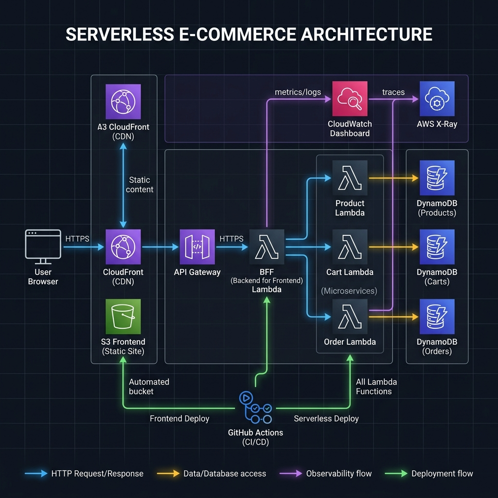
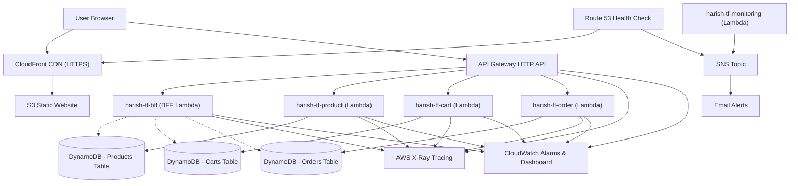

# Serverless E-Commerce Platform

This repository contains a serverless e-commerce platform built with AWS and configured entirely through Terraform. The project is designed using serverless-native patterns to keep costs at practically zero (running within the AWS Free Tier) while demonstrating distributed microservices, transactional resilience, and full-stack observability.

---

## Cloud Architecture

The platform uses a decoupled microservices architecture with a Backend-for-Frontend (BFF) aggregator pattern, served over HTTPS via CloudFront.



### Design Choices
- **Global Asset Delivery**: The frontend is hosted on S3 and distributed via CloudFront. To keep the bucket secure, we block all public access to S3 and use CloudFront Origin Access Control (OAC) to sign and verify requests.
- **Orchestration & Parallel Fetching**: Client requests route through an HTTP API Gateway. For dashboard loads, a Backend-For-Frontend (BFF) Lambda fetches cart data, order history, and product recommendations in parallel using Python's concurrent `ThreadPoolExecutor`, reducing client-side network round-trips.
- **On-Demand Databases**: DynamoDB tables store products, carts, and orders. To view user order histories efficiently, we query a Global Secondary Index (GSI) on the orders table rather than performing expensive full-table scans.
- **CI/CD Checks**: We use GitHub Actions to run unit tests, check Terraform formatting, and validate our configuration files on every push or pull request.
- **Observability**: Request traces are captured using AWS X-Ray with a 10% sampling rate to limit costs. Active system health is monitored via custom CloudWatch Alarms and a consolidated operations dashboard.

### Request Flow and Infrastructure (Mermaid)



---

## Deployed Environment Details

- **AWS Region**: `ap-southeast-1` (Singapore)
- **AWS SSO Profile**: `idp-sbx-trn-lab-01`
- **Frontend Site**: [https://dkqvng2r6hn4j.cloudfront.net](https://dkqvng2r6hn4j.cloudfront.net)
- **API Endpoint**: `https://490z9zcjr8.execute-api.ap-southeast-1.amazonaws.com/v1/`

---

## Getting Started and Local Verification

### Prerequisites
- Python 3.12 or 3.13
- Terraform 1.5.7 or higher
- AWS CLI configured with SSO profile `idp-sbx-trn-lab-01`

### Running Unit Tests
You can run the full test suite locally. It contains 38 tests verifying cart logic, product operations, orders, and the BFF service:
```bash
python -m pytest -v
```

### Seeding the Catalog and Verifying Scenarios
We wrote a python script called `seed_and_demo.py` in the root folder. It pulls variables from Terraform, seeds products into the catalog, and runs automated tests verifying stock rollbacks, idempotency, and validations:
```bash
python seed_and_demo.py
```

### Deployed Integration Testing
To run tests directly against the live AWS endpoints to ensure everything is working correctly in the cloud:
```bash
python -m pytest test_integration.py -v
```

---

## Resilience and Concurrency Features

Our order placement flow is built to be transactional and handle network issues gracefully:

### 1. Atomic Stock Reservations and Concurrency Rollback
To prevent race conditions where two customers buy the same product at the same time:
1. When checking out, the order service attempts to reserve stock for all cart items.
2. It uses a DynamoDB condition expression (`ConditionExpression="attribute_exists(product_id) AND stock >= :qty"`) to decrement stock atomically.
3. If any product is out of stock, the conditional write fails. The service catches this exception and immediately increments the stock back up for any products it successfully reserved earlier in the loop.
4. This ensures that a customer never gets a partially fulfilled order and we never sell more stock than we have.

### 2. Case-Insensitive Idempotent Checkouts
If a customer double-clicks checkout or has a spotty connection, we want to prevent duplicate orders and double charges:
- The checkout request takes an `Idempotency-Key` header.
- The order service checks if this key already exists in the orders table. If it does, we return the previously saved order directly (`200 OK`) and skip stock updates.
- If two identical requests hit the service at the exact same moment, DynamoDB's unique constraint (`attribute_not_exists(order_id)`) blocks the duplicate write. The failing request then safely rolls back its stock reservations.

---

## API Service Endpoints

### BFF Aggregator
- **GET** `/v1/bff/dashboard?userId={userId}`
  - Fetches product catalog, user cart, and user orders in parallel.

### Product Catalog
- **GET** `/v1/products` - List all products
- **POST** `/v1/products` - Add product
  - *Payload*: `{"product_id": "P-100", "name": "Phone", "price": 499.99, "description": "Latest Phone", "stock": 10}`
- **PUT** `/v1/products/{id}` - Edit product
- **DELETE** `/v1/products/{id}` - Delete product
- **POST** `/v1/products/{id}/review` - Submit a star review
  - *Payload*: `{"user_id": "user-123", "order_id": "order-key", "rating": 5}`

### Shopping Cart
- **GET** `/v1/cart/{userId}` - View cart items
- **POST** `/v1/cart` - Add item to cart
  - *Payload*: `{"user_id": "user-123", "product_id": "P-100", "quantity": 2}`
- **PUT** `/v1/cart/{userId}/{productId}` - Update quantity
  - *Payload*: `{"quantity": 3}`
- **DELETE** `/v1/cart/{userId}/{productId}` - Remove item
- **DELETE** `/v1/cart/{userId}` - Clear cart

### Order Processing
- **GET** `/v1/orders/{orderId}` - View order details
- **GET** `/v1/orders/user/{userId}` - View user's orders (via high-performance GSI query)
- **POST** `/v1/orders` - Place order from cart
  - *Headers*: `Idempotency-Key: <unique-key>`
  - *Payload*: `{"user_id": "user-123", "shipping_address": "123 Tech St", "email": "customer@test.com"}`
- **PUT** `/v1/orders/{orderId}/status` - Update order status (Admin)
  - *Payload*: `{"status": "DISPATCHED"}`
- **DELETE** `/v1/orders/{orderId}` - Cancel order

---

## Observability and Load Generation

To make it easy to evaluate performance, we have set up telemetry that is easy to populate and view:

### 1. Generating Demo Traffic Load
You can run a traffic load generator that sends random API requests (cart additions, browse calls, checkouts, and stock failures) to generate metric lines and tracing details:
```bash
# Generates 100 API transactions over 1-2 minutes
python seed_and_demo.py --load 100
```

### 2. CloudWatch Dashboard
You can view the dashboard by opening the AWS Console and navigating to **CloudWatch -> Dashboards -> `harish-tf-dashboard`**.
It displays:
- **Executive Overview**: Availability status, Edge CDN request rates, API Latency averages.
- **Business KPIs**: Active tracking of successful orders, failed orders, and revenue generated (custom metrics).
- **Latency Percentiles**: Average, p50, p90, p95, and p99 latencies.
- **Serverless Metrics**: Lambda execution rates, errors, and DynamoDB capacity throttles.

### 3. Metric Alarms
Five alarms monitor system health:
1. **Frontend Downtime Alert**: Triggers if Route53 health checks report CDN issues.
2. **High API Latency**: Triggers if latency exceeds 2 seconds for 2 consecutive minutes.
3. **API 5XX Errors**: Triggers on server-side errors.
4. **Consolidated Lambda Errors**: Triggers if the sum of Lambda errors exceeds 5 in a minute.
5. **DynamoDB Throttling**: Triggers if read/write capacity limits throttle transactions.

---

## CI/CD Pipeline

Continuous integration is handled via GitHub Actions in `.github/workflows/main.yml`. On every push or pull request to the `main` branch, the pipeline executes:
1. **Unit Testing**: Runs Python `pytest` suite.
2. **Terraform Format Check**: Verifies formatting (`terraform fmt -check`).
3. **Terraform Init**: Performs static provider initialization (`terraform init -backend=false`).
4. **Terraform Validate**: Runs local validation checks (`terraform validate`).

---

## Future Scalability: A Low-Cost Analytics Pipeline

If you decide to add data engineering capabilities later, we recommend a simple event-driven model that has zero idle cost:

```
DynamoDB Orders Table
       ↓ (Enable DynamoDB Streams)
DynamoDB Streams
       ↓ (Batch trigger)
Order Analytics Lambda
       ↓ (Compress and write)
S3 Bucket (JSON reports / archives)
```

### Why this design is ideal
- **No Idle Fees**: Unlike Kinesis Firehose or NAT Gateways, which have high hourly minimum charges, Lambda and DynamoDB Streams only charge you when orders are placed.
- **Simplicity**: No need to configure Glue crawlers or deal with partition overhead.
- **Ad-Hoc Queries**: You can query the S3 JSON files using Amazon Athena on-demand, paying only for the data scanned (approx $5 per TB).
