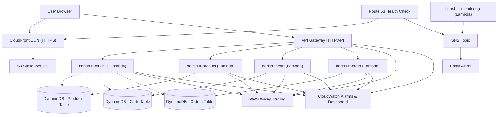

# Serverless E-Commerce Platform with Terraform

## Project Overview
This project is a high-value, cost-efficient serverless e-commerce application built with AWS and Terraform. It leverages serverless-native design patterns to deliver observability, resilience, and microservice orchestration at negligible cost.

It includes:
- **Multi-Service Infrastructure Setup**: Deployed with AWS Lambda, DynamoDB, API Gateway, S3, and CloudFront CDN.
- **BFF (Backend-For-Frontend) Lambda**: Orchesrates parallel fetching of cart details, order history, and product recommendations using Python's concurrent `ThreadPoolExecutor`.
- **API Hardening**: Enforces custom request schema validation and case-insensitive `Idempotency-Key` headers on order checkouts to prevent duplicate orders.
- **Database Optimizations**: Leverages a Global Secondary Index (GSI) query instead of expensive table scans to fetch user orders.
- **Production-Quality Observability**: Full X-Ray tracing integration (10% sampling rule for cost efficiency), a custom CloudWatch Monitoring Dashboard, and a consolidated Lambda errors metric alarm.
- **Multi-Stage CI/CD Pipeline**: GitHub Actions workflow containing unit tests, Terraform format checks, validation, automated planning, deployment, and post-deploy smoke tests.

---

## What I Have Done
- Configured the AWS provider, variables, and Terraform project structure
- Created IAM roles and policies for Lambda execution and DynamoDB access
- Built 3 main backend services using Python Lambda:
  - Product service for create, list, update, and delete
  - Cart service for add, view, update, remove, and clear cart
  - Order service for create, fetch, list by user, and cancel order
- Added a monitoring Lambda that sends an SNS alert if the frontend is not reachable
- Created DynamoDB tables for products, carts, and orders
- Added an order table secondary index for querying orders by user
- Configured HTTP API Gateway with `/v1` routes for product, cart, and order operations
- Added Lambda permissions for API Gateway invocation
- Created an S3 bucket for static website hosting
- Uploaded the frontend application through Terraform
- Added Route 53 health check and SNS topic/subscription for frontend alerts
- Defined Terraform outputs for API URL, frontend URL, table names, and Lambda details
- Added unit test files for the product, cart, and order Lambda functions
- Added 5 star Review Feature for the products after the order is placed
- Added a BFF Lambda function that aggregates cart, recent orders, and recommended products in parallel
- Configured API Gateway integrations, routing, and default rate-limiting/throttling settings
- Integrated the new BFF Lambda function metrics and consolidated alarms into the CloudWatch dashboard
- Implemented lightweight, dependency-free schema validation for incoming request payloads
- Implemented `Idempotency-Key` headers checks, unique constraint checks, and database checks on checkout
- Optimized user order history queries by targeting the DynamoDB Global Secondary Index instead of scanning the table
- Created a full-stack integration test suite running against real deployed AWS endpoints
- Uncommented linting/validation pipeline workflows and added a post-deployment curl smoke test

---

## Architecture Diagram


### Architecture Summary
- **Frontend**: Hosted on S3 and distributed securely with HTTPS via CloudFront.
- **Aggregation**: BFF Lambda serves as a single entry point for complex dashboard layouts, resolving microservice orchestration in parallel.
- **Observability**: CloudWatch metrics track latency, execution rates, error limits, and DB capacity. CloudWatch metric alarm triggers email alerts via SNS on high latency, Route 53 health failures, or Lambda faults.

---

## Services & API Endpoints

### Backend Functions
- `product` Lambda
- `cart` Lambda
- `order` Lambda
- `bff` Lambda
- `monitoring` Lambda

### API v1 Routes
Primary endpoints use URL path versioning under `/v1`:

- **BFF Orchestration**:
  - `GET /v1/bff/dashboard?userId={user_id}` (Aggregated cart, orders, and product catalog)
- **Product Catalog**:
  - `GET /v1/products` (List all products)
  - `POST /v1/products` (Create product)
  - `PUT /v1/products/{id}` (Update product)
  - `DELETE /v1/products/{id}` (Delete product)
  - `POST /v1/products/{product_id}/review` (Submit a 1-5 star review)
- **Shopping Cart**:
  - `GET /v1/cart/{user_id}` (Get user's cart details)
  - `POST /v1/cart` (Add item to cart)
  - `PUT /v1/cart/{user_id}/{product_id}` (Update quantity)
  - `DELETE /v1/cart/{user_id}/{product_id}` (Remove item)
  - `DELETE /v1/cart/{user_id}` (Clear cart)
- **Order Processing**:
  - `GET /v1/orders/{order_id}` (Get order details)
  - `GET /v1/orders/user/{user_id}` (Get user orders - optimized GSI query)
  - `POST /v1/orders` (Idempotent order checkout from cart)
  - `DELETE /v1/orders/{order_id}` (Cancel order)

---

## Project Structure
```text
harish-terraform-project/
├── terraform/          # Infrastructure-as-code configurations
├── backend/            # Lambda backend services
│   ├── shared/         # Shared utilities (DynamoDB connection, validation, logging)
│   ├── product/        # Product catalog handler & tests
│   ├── cart/           # Cart handler & tests
│   ├── order/          # Order handler, rollback logic & tests
│   └── bff/            # BFF dashboard lambda handler & tests
├── frontend/           # Vite + React web application
├── test_integration.py # Full-stack live endpoint integration test
├── QUICK_START.md      # Setup, commands, and local scripts guide
├── SYSTEM_GUIDE.md     # Code design, database schemas, and workflows guide
└── DEPLOYMENT_SUMMARY.md
```

---

## How to Run & Verify

### Deploy Infrastructure
```bash
cd terraform
terraform init
terraform validate
terraform plan
terraform apply -auto-approve
```

### Run Unit Tests
To run the 38 backend unit tests locally:
```bash
python -m pytest
```

### Run Integration Tests
To verify live endpoints on the AWS deployment:
```bash
python -m pytest test_integration.py -v
```

---

## Notes
- **AWS Region**: `ap-southeast-1` (Singapore)
- **Python Runtime**: `python3.12`
- **Resource Prefixes**: `harish-tf`
- **Throttling limit**: Default rate limits are restricted to 100 req/s with a 200 burst limit via API Gateway Stage settings.
- **X-Ray sampling**: Traced actively with a fixed rate of 10% to prevent excessive AWS billing charges.
